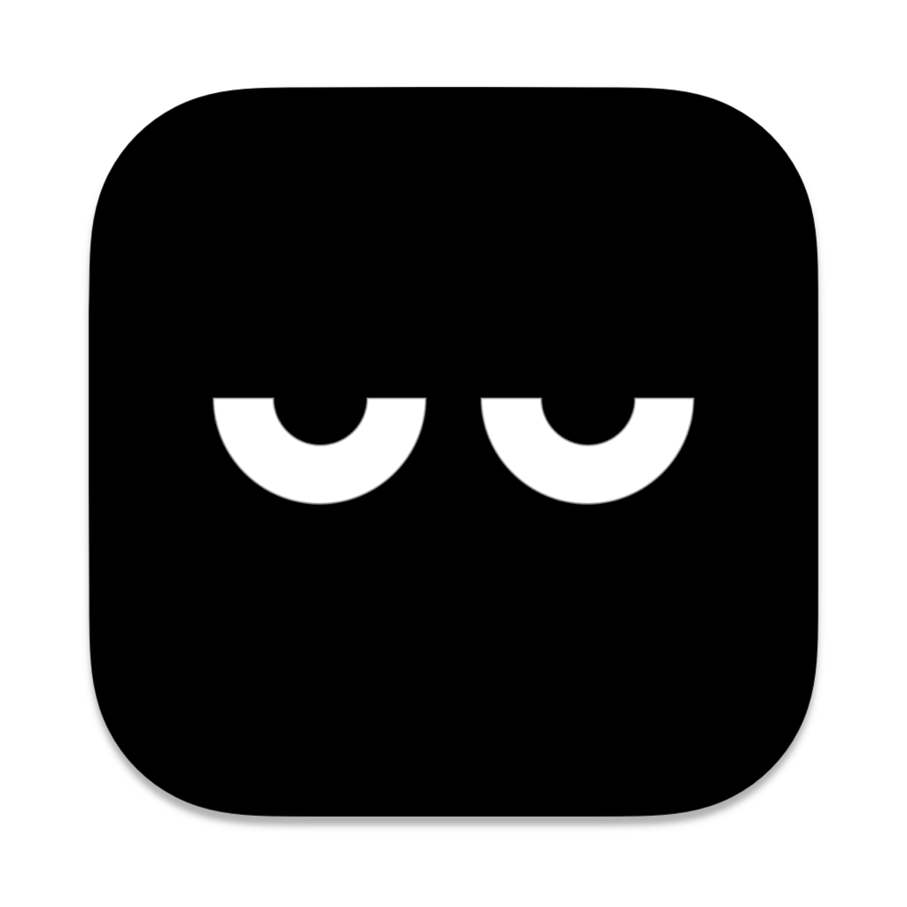
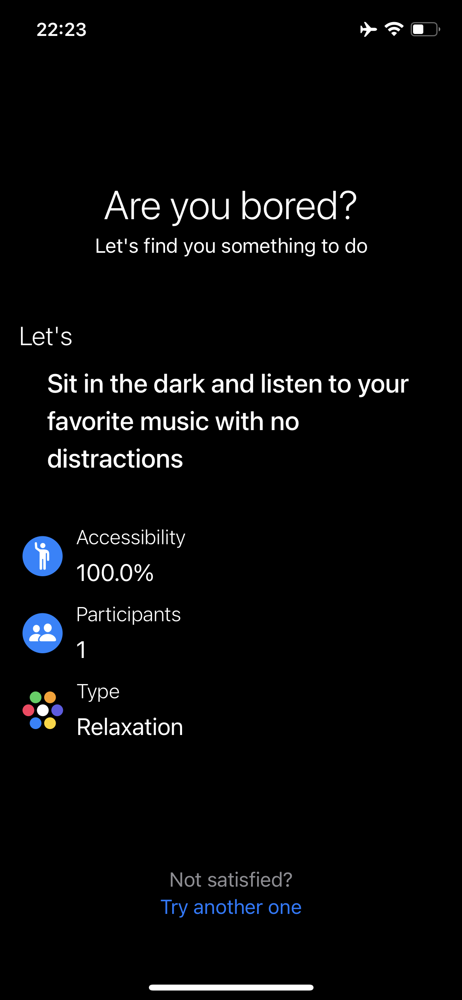
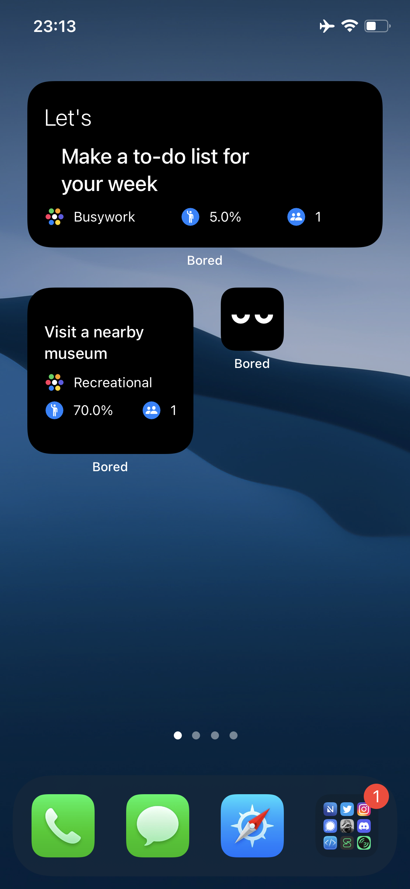
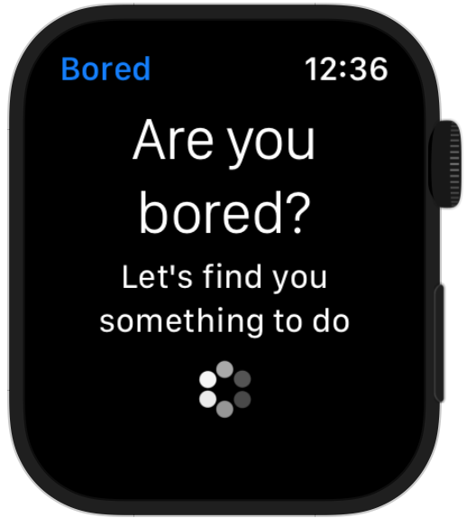
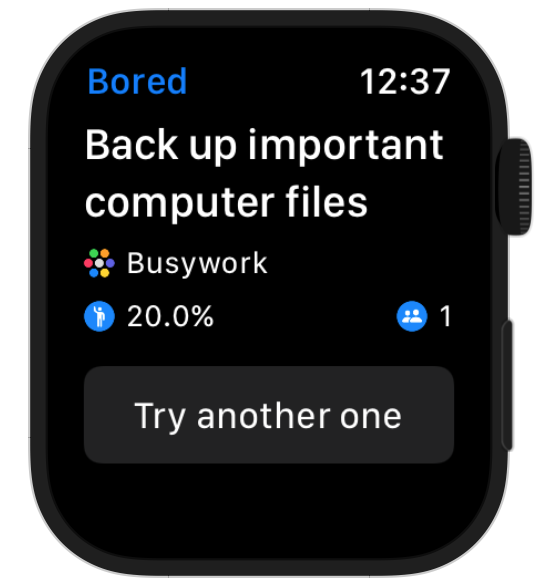
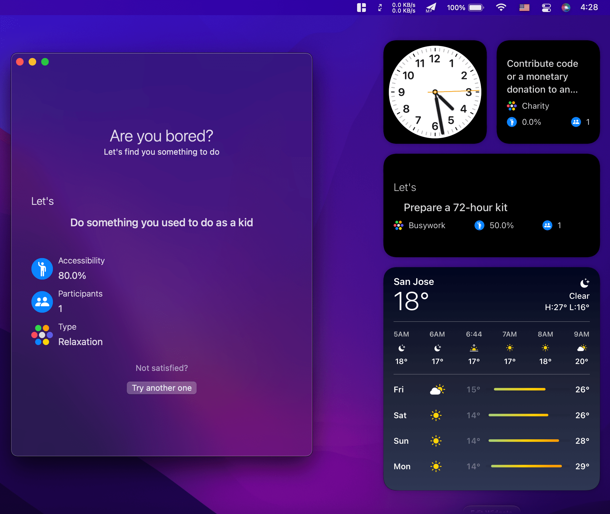

Bored Swift
======

Are you bored? This app helps find you something to do via [Bored api](https://www.boredapi.com/)

## Features
- Beautiful widgets 📅
- Simple and easy ✅
- Open source 📱

## Previews 📱

  
  

  
  

  

## How to build 🛠

- Fork the project & Clone it to your desktop.

- Open it from Xcode (12.0+ ⚠️).

- Change  the Build identifier (for iOS Widget extension should be changed too).

- build & run.

## Contribute 🧩

Want to contribute? I would really appreciate a hand with the development to add more features in this app.
Feel free to Fork, edit, then pull!

## Copyright Notice 📝

Copyright (C) 2021 Armin Shalchian

Licensed under the [GNU Version 3](https://www.gnu.org/licenses/gpl-3.0.en.html) license (see the LICENSE file).

The icon is inspired by [Bored eyes](https://dribbble.com/shots/5536525-Bored-Eyes)
